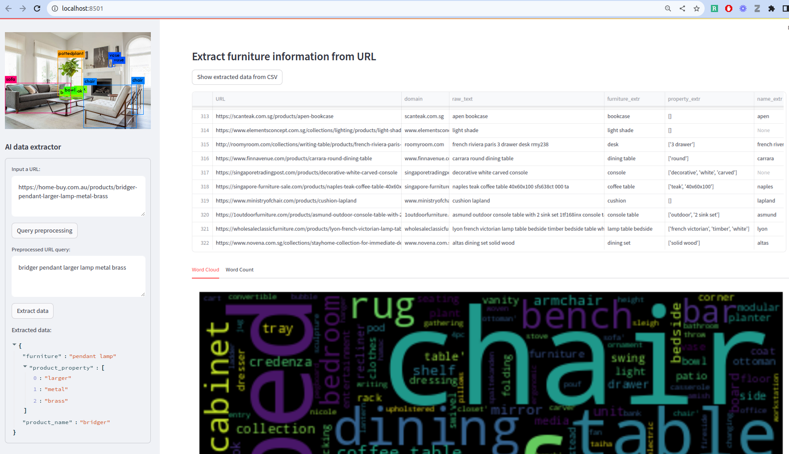
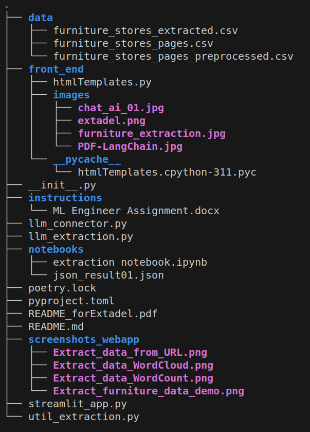

# Data extraction from URL 
derived from the e-commerce sector

## The main goal of the solution is from a URL to extract 
if they are present at all

1. Furniture objects (products)
2. Properties of the extracted objects such as:
    * colour
    * size
    * shape
    * what the product is made of (fabric, metal, wood)
    * .... 
3. Name of the product

### State-of-the-art Generative AI extraction methods have been applied
_Generative Pre-trained Transformers, commonly known as GPT, are a family of neural network models that uses the transformer architecture. In this solution [in-context learning](https://ai.stanford.edu/blog/understanding-incontext/) (ICL) has been applied on a small subset of manually processed URLs. It can be considered as part of the so called "Prompt Engineering"._

More precisely, the Web-application gives the option to the user to experiment with
different URLs in the left side-bar:
- Put the URL \
Example: https://home-buy.com.au/products/bridger-pendant-larger-lamp-metal-brass 
- Preprocess it to clean some unsignificant information such as the domain of the URL through regular expressions \
Example: _bridger pendant larger lamp metal brass_ 
- Get the extracted data in JSON format 
    - "furniture": "_pendant lamp_" 
    - "product_property": _["larger", "metal", "brass"]_ 
    - "product_name": "_bridger_"

The user is given the option to load and visualize preprocessed CSV file with sample URLs \
by pushing the button "Show extracted data from CSV". \
The extracted fields are: **furniture_extr**, **property_extr**, **name_extr** \
The user is also given some simple data visualization of the extracted furniture objects in \
the form of "Word Cloud" and "Word Count" histogram. *

**The result of the processed CSV input file is [_./data/furniture_stores_extracted.CSV_](./data/furniture_stores_extracted.CSV_) and the extracted fields, as described above, are in that file.**

Fig 1. _Screenshot of the app_

<!--  -->

## Tech-stack

1. For the AI (data extraction) part
    - [LangChain](https://python.langchain.com/): framework for developing applications powered by language models
    - [OpenAI/GPT-3](https://openai.com/blog/gpt-3-apps): Transformers' powered search, conversation, text completion, and other advanced AI features
2. For the front-end and web app development
    - [Streamlit](https://streamlit.io/): open-source Python based app framework suitable for Machine Learning and Data Science
3. For the project packaging part
    - [Poetry](https://python-poetry.org/)

## Instructions on how to setup and run the streamlit web app on Linux (Ubuntu)
For Windows and Mac the same should work 

0. You should have an OpenAI key ([how to create one](https://gptforwork.com/help/gpt-for-docs/setup/create-openai-api-key)) and put it in the file _.env_
1. Install Python _version 3.11_
2. Install [Poetry](https://python-poetry.org/docs/#installation) 
3. In a terminal go to the project directory and activate a python _virtual environment_ with: \
_poetry shell_
4. Run the command: \
_poetry install_
5. Run the command: \
_streamlit run streamlit.app_ \
and in a browser open: [http://localhost:8501/](http://localhost:8501/)

